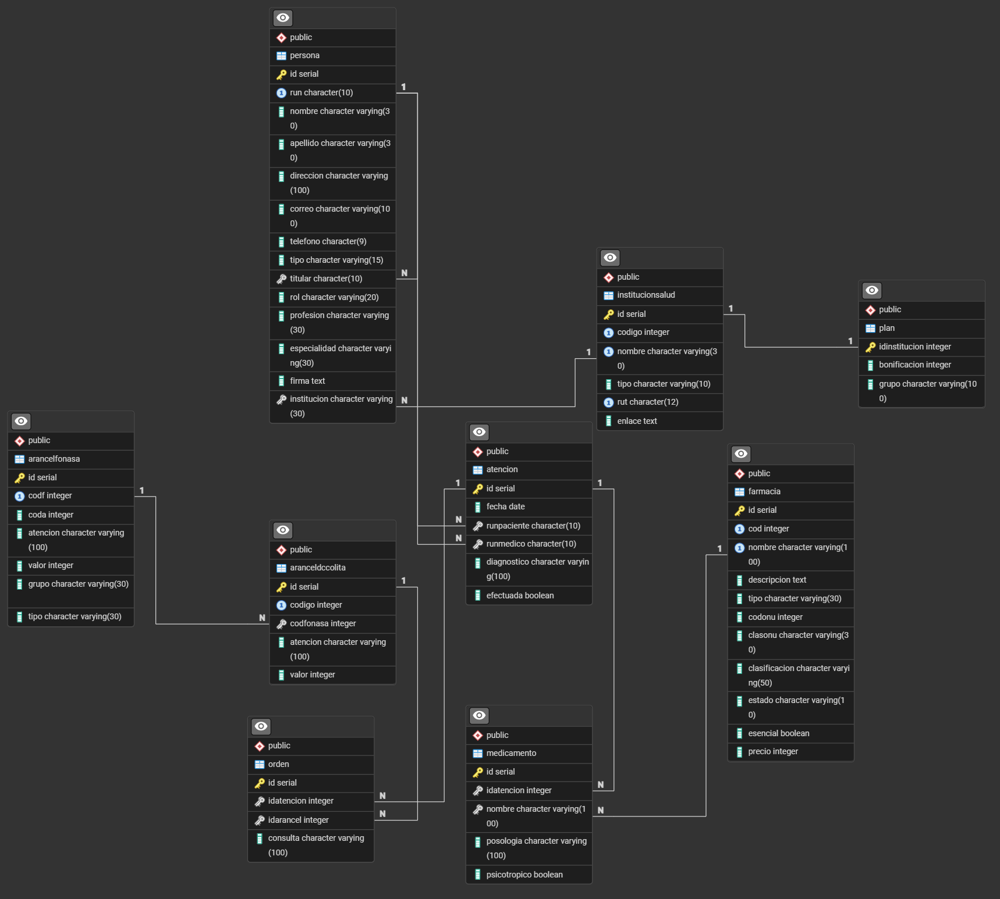

# Informe Entrega 3 - Bases de datos IIC2413

### Datos del Alumno
| **Apellidos**       | **Nombres**          | **Número de Alumno** |
|---------------------|----------------------|----------------------|
| Landerer Contreras  | Matías Antonio       | 25663119             |

### 1. Esquema Base de Datos 
<!-- Inserta aquí la imagen del esquema Usa el formato svg para evitar la perdida de calidad. Reemplaza "diagrama.svg" por la ruta a tu archivo -->
#### Diagrama creado en base al esquema en BCNF usado para la carga de datos (El esquema puede ser encontrado en cargar.sql).

### 2. Data cleaning en PHP
<!-- Justifica CADA acción tomada sobre registros erroneos -->
| Error.                    | Archivo                              | Acción.      | Solución                                  |
|:--------------------------|:-------------------------------------|:-------------|:------------------------------------------|
| Correo con tildes.        | Persona                              | Corrección   | Cambio de letra con tilde por sin tilde.  |
| Correo con 2 @.           | Persona                              | Corrección   | Eliminación del @ extra.                  |
| RUN de tamaño incorrecto. | Persona                              | Elimina      | Se elimina la tupla entera.               |
| Enlace sin https.         | Instituciones previsionales de salud | Corrección   | Se agrega el https.                       |
| Teléfono de mal tamaño.   | Persona                              | Corrección   | Se reemplaza por 100000000.               |
| RUT con '-' muy largo.    | Instituciones previsionales de salud | Corrección   | Se reemplaza por un '-' normal.           |
| Fecha incompleta.         | Atención                             | Elimina      | Se elimina la tupla entera.               |
| Tupla vacía.              | Instituciones previsionales de salud | Elimina      | Se elimina la tupla entera.               |
| Espacio sin atributo.     | Persona                              | Elimina      | Se elimina la tupla entera.               |
| Espacio sin atributo.     | Orden                                | Elimina      | Se elimina la tupla entera.               |
| Profesión mal escrita.    | Persona                              | Corrección   | Se escribe la profesión bien.             |
| Precio en formato float.  | Arancel fonasa                       | Corrección   | Se cambia a int.                          |

Indicar los registros con correos con tildes

### 2. Data cleaning en DBMS
<!-- Justifica CADA acción tomada sobre registros erroneos -->
| Error.                 | Tabla     | Acción.      | Solución                                  |
|:-----------------------|:----------|:-------------|:------------------------------------------|
| atributo PK duplicado. | Persona   | Elimina.     |                                           |
|                        |           |              |                                           |
Indicar los registros con atributo PK duplicado

### 3. Instrucciones de ejecución de Entrega
<!-- Indica las instrucciones para ejecutar el archivo PHP y SQL -->
Solo hace falta ejecutar main.php y cargar.sql. main.php requiere de otro archivo llamado datos_fuera_formato.php, que es el que hace el trabajo pesado. No hace falta ejecutar este segundo archivo, pues se ejecuta al correr main.php, pero es importante que ambos estén en el mismo directorio.

Lo mismo con los archivos originales, deben estar en el mismo directorio que main.php para que este funcione bien, y los archivos XXXOK.csv junto con las carpetas planes y firmas deben estar en el mismo directorio que cargar.sql para que este pueda cargarlos correctamente.

Además de los archivos XXXOK.csv no hace falta nada más para correr cargar.sql, pues todo está en aqueñ archivo. Se necesitaría ejecutar en psql y que haya una base de datos ya creada, pero vacía, sin tablas, pues cargar.sql se encarga de crear las tablas y cargar los datos.

PD: main.php tarda un par de segundos en ejecutarse.

### 4. Observaciones adicionales
- En las tablas de justificación de acción, cuando se repiten errores solo se registra una vez, esto debido a que en ocaciones se corrigieron hasta 1000 datos, por lo que es imposible colocarlos todos en la tabla.

- Los archivos XXXERR.csv y XXXLOG.csv siempre se crean, aún si no se encontraron errores en el archivo original, es decir, si en un archivo no se detecta ningún error, igaul se crearán XXXERR.csv y XXXLOG.csv, solo que estarán vacíos. Los archivos XXXOK.csv también se crean siempre, en caso de que no se detecten errores en un archivo igual se creará XXXOK.csv, solo que será idéntico al original. Y obviamente en caso de que se detecten errores XXXOK.csv será la versión corregida.

- Notarán que hay filtros en main.php que no se ven reflejados en la tabla de este informe, esto se debe a que en la tabla solo están los errores captados. Hubieron algunos escenarios que se abordaron en main.php pero no detectaron ningún error, pero se mantuvieron para tener más robustez (Ej: se revisa titular de persona, pero no se detecta nada, asi que no está en la tabla).

- Como en el enunciado dice 'Todos los archivos .csv originales y procesados, los .txt y .sql en el directorio E3', asumí que había que subir todos los archivos, incluyendo los generados por main.php.